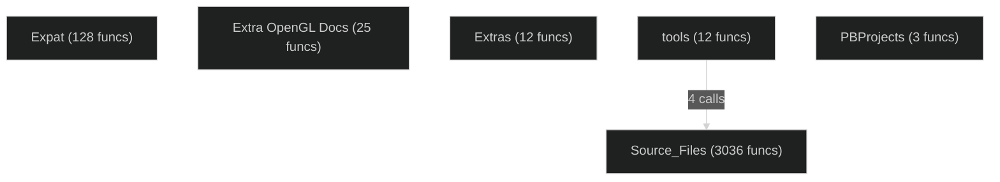

# Call Graph & Dependency Diagrams

Auto-generated from per-file architecture docs.

## Function Call Graph

Showing functions with 2+ incoming calls. Limited to 150 edges.

```mermaid
%%{ init: { 'theme': 'dark', 'flowchart': { 'curve': 'basis' } } }%%
graph LR

  subgraph Expat
    doParseXmlDecl["doParseXmlDecl"]
    getEncodingIndex["getEncodingIndex"]
    initScan["initScan"]
    main["main"]
    NS_findEncoding_["NS(findEncoding)"]
    NS_XmlInitEncoding_["NS(XmlInitEncoding)"]
    printTabs["printTabs"]
    utf8_toUtf16["utf8_toUtf16"]
    XML_Parse["XML_Parse"]
    XmlInitUnknownEncoding["XmlInitUnknownEncoding"]
  end

  subgraph Extra OpenGL Docs
    Display["Display"]
    DisplayInfo["DisplayInfo"]
    DoTransform["DoTransform"]
    GetGLProcs["GetGLProcs"]
    Init["Init"]
    InitMatrices["InitMatrices"]
    Key___Button["Key / Button"]
    Keyboard["Keyboard"]
    main["main"]
    MakeTextures["MakeTextures"]
    Motion["Motion"]
    Redraw["Redraw"]
    Reshape["Reshape"]
    setCheckedTexture["setCheckedTexture"]
    UpdateModelView["UpdateModelView"]
  end

  subgraph Extras
    add_resource["add_resource"]
    build_sounds_file["build_sounds_file"]
    extract_shape_resources["extract_shape_resources"]
    extract_sound_resources["extract_sound_resources"]
    main["main"]
  end

  subgraph PBProjects
  end

  subgraph Source_Files
    _UnloadTextures__["_UnloadTextures()"]
    _OGL_Blitter__Destructor_["~OGL_Blitter (Destructor)"]
    _PlayerImage__destructor_["~PlayerImage (destructor)"]
    add_node__private_["add_node (private)"]
    AIStream__read_T__uint32_["AIStream::read(T, uint32)"]
    allocate_flood_map_memory["allocate_flood_map_memory"]
    allocate_map_memory["allocate_map_memory"]
    allocate_texture_tables["allocate_texture_tables"]
    AngleAndVolumeToStereoVolume["AngleAndVolumeToStereoVolume"]
    AnimTxtr_Update__global_["AnimTxtr_Update (global)"]
    AOStream__write_T__uint32_["AOStream::write(T, uint32)"]
    associateNotificationAdapter___notificationAdapter["associateNotificationAdapter / notificationAdapter"]
    audio_input_proc["audio_input_proc"]
    begin_polygons___end_polygons["begin_polygons / end_polygons"]
    BestChannel["BestChannel"]
    BigChunkOfDataMessage___BigChunkOfDataMessage["BigChunkOfDataMessage::~BigChunkOfDataMessage"]
    BigChunkOfDataMessage__clone["BigChunkOfDataMessage::clone"]
    BigChunkOfDataMessage__deflate["BigChunkOfDataMessage::deflate"]
    BoostThreadPriority["BoostThreadPriority"]
    BufferSound["BufferSound"]
    build_base_node_list____private_["build_base_node_list() [private]"]
    build_render_object____private_["build_render_object() [private]"]
    build_shading_tables16___build_shading_tables32["build_shading_tables16 / build_shading_tables32"]
    calculate_buffer_crc["calculate_buffer_crc"]
    calculate_data_crc_ccitt["calculate_data_crc_ccitt"]
    calculate_endpoint_polygon_owners["calculate_endpoint_polygon_owners"]
    CalculateSoundVariables["CalculateSoundVariables"]
    CEvtHandleApplicationMouseEvents["CEvtHandleApplicationMouseEvents"]
    change_light_state["change_light_state"]
    ChatHistory__append["ChatHistory::append"]
    ChatHistory__clear["ChatHistory::clear"]
    choose_random_flood_node["choose_random_flood_node"]
    close_network_microphone["close_network_microphone"]
    close_network_speaker["close_network_speaker"]
    close_network_speaker__["close_network_speaker()"]
    CloseLuaHUDScript["CloseLuaHUDScript"]
    Color_transformation_functions__tint_color_table__randomize_color_table__etc__["Color transformation functions (tint_color_table, randomize_color_table, etc.)"]
    ColorfulChatWidget___ColorfulChatWidget["ColorfulChatWidget::~ColorfulChatWidget"]
    Configure_ChaseCam["Configure_ChaseCam"]
    Configure_ChaseCam_Handler___Configure_Crosshair_Handler["Configure_ChaseCam_Handler / Configure_Crosshair_Handler"]
    Configure_ChaseCam_HandlerData__VerifyAndAdjust["Configure_ChaseCam_HandlerData::VerifyAndAdjust"]
    Configure_Crosshairs["Configure_Crosshairs"]
    connect["connect"]
    ConnectPool_ConnectPool__instance__["ConnectPool ConnectPool::instance()"]
    ConnectPool__connect_string__uint16____connect_IPaddress_["ConnectPool::connect(string, uint16) / connect(IPaddress)"]
    Console__enter["Console::enter"]
    Crosshairs_Render["Crosshairs_Render"]
    csprintf___psprintf["csprintf / psprintf"]
    damage_player["damage_player"]
    DatalessMessage_tMessageType___template__extends_Message_["DatalessMessage<tMessageType> (template, extends Message)"]
    Decode["Decode"]
    DecodeFrame["DecodeFrame"]
    dequeue_network_speaker_data__["dequeue_network_speaker_data()"]
    destroy_speex_decoder["destroy_speex_decoder"]
    Destructor["Destructor"]
    dialog__event["dialog::event"]
    dialog__process_events["dialog::process_events"]
    dialog__run["dialog::run"]
    DirectorySpecifier__SetToSubdirectory["DirectorySpecifier::SetToSubdirectory"]
    DirectPlaySound["DirectPlaySound"]
    display_device_dialog__USES_NIBS_version_["display_device_dialog (USES_NIBS version)"]
    display_screen["display_screen"]
    distance2d___distance3d["distance2d / distance3d"]
    Draw_SDL_Surface_dst_surface__SDL_Rect__dst__SDL_Rect__src_["Draw(SDL_Surface dst_surface, SDL_Rect& dst, SDL_Rect& src)"]
    draw_ammo_display_in_panel["draw_ammo_display_in_panel"]
    draw_bar["draw_bar"]
    draw_inventory_item["draw_inventory_item"]
    draw_path["draw_path"]
    draw_player_name["draw_player_name"]
    draw_thing["draw_thing"]
    DrawCachedPolygons___DrawCachedLines["DrawCachedPolygons / DrawCachedLines"]
    DrawShape["DrawShape"]
    DrawShapeAtXY["DrawShapeAtXY"]
    DrawText["DrawText"]
    DrawTexture["DrawTexture"]
    ensure_HUD_buffer["ensure_HUD_buffer"]
    enter_mouse["enter_mouse"]
    Enumerate["Enumerate"]
    error_pending["error_pending"]
    exit_mouse["exit_mouse"]
    Exit1__["Exit1()"]
    Exit2__["Exit2()"]
    ExternalSoundHeader__LoadExternal["ExternalSoundHeader::LoadExternal"]
    File_string_loading__luaL_loadfile___luaL_loadbuffer___luaL_loadstring_["File/string loading (luaL_loadfile / luaL_loadbuffer / luaL_loadstring)"]
    FileFinder__Find["FileFinder::Find"]
    FileSpecifier__CopyContents["FileSpecifier::CopyContents"]
    FileSpecifier__GetType["FileSpecifier::GetType"]
    FileSpecifier__Open__OpenedFile_variant_["FileSpecifier::Open (OpenedFile variant)"]
    FileSpecifier__ReadDialog___WriteDialog["FileSpecifier::ReadDialog / WriteDialog"]
    FileSpecifier__SetNameWithPath["FileSpecifier::SetNameWithPath"]
    fill_network_speaker_buffer["fill_network_speaker_buffer"]
    FillRect["FillRect"]
    find_intersecting_endpoints_and_lines["find_intersecting_endpoints_and_lines"]
    flip_surface["flip_surface"]
    flood_map["flood_map"]
    FrameRect["FrameRect"]
    GameAvailableMetaserverAnnouncer__Start["GameAvailableMetaserverAnnouncer::Start"]
    GameListMessage__GameListEntry__game_string___format_for_chat["GameListMessage::GameListEntry::game_string / format_for_chat"]
    gamma_correct_color_table["gamma_correct_color_table"]
    GatherDialog__gathered_player["GatherDialog::gathered_player"]
    GatherDialog__idle["GatherDialog::idle"]
    generate_false_automap["generate_false_automap"]
    get_effect_data["get_effect_data"]
    get_file_spec["get_file_spec"]
    get_light_data["get_light_data"]
    get_light_intensity["get_light_intensity"]
    get_light_status["get_light_status"]
    get_mouse_location["get_mouse_location"]
    get_my_fsspec["get_my_fsspec"]
    get_player_data["get_player_data"]
    get_shape_surface["get_shape_surface"]
    GetCrosshairData["GetCrosshairData"]
    GetCtrlFromWindow["GetCtrlFromWindow"]
    GetOnScreenFont["GetOnScreenFont"]
    getpstr["getpstr"]
    guess_distance2d__["guess_distance2d()"]
    handle_network_game["handle_network_game"]
    handle_switch["handle_switch"]
    handleDataArrival["handleDataArrival"]
    hub_received_network_packet["hub_received_network_packet"]
    hub_tick["hub_tick"]
    HUD_Class__motion_sensor_scan["HUD_Class::motion_sensor_scan"]
    HUD_OGL_Class__DrawShapeAtXY["HUD_OGL_Class::DrawShapeAtXY"]
    HUD_OGL_Class__DrawTexture["HUD_OGL_Class::DrawTexture"]
    HUD_OGL_Class__SetClipPlane___DisableClipPlane["HUD_OGL_Class::SetClipPlane / DisableClipPlane"]
    Idle["Idle"]
    ImageDescriptor__LoadDDSFromFile["ImageDescriptor::LoadDDSFromFile"]
    ImageDescriptor__LoadMipMapFromFile["ImageDescriptor::LoadMipMapFromFile"]
    ImageDescriptor__MakeDXTC3["ImageDescriptor::MakeDXTC3"]
    ImageDescriptor__MakeRGBA["ImageDescriptor::MakeRGBA"]
    ImageDescriptor__Minify["ImageDescriptor::Minify"]
    ImageDescriptor__Resize["ImageDescriptor::Resize"]
    Init["Init"]
    Initialize["Initialize"]
    initialize_fades["initialize_fades"]
    initialize_game_state["initialize_game_state"]
    initialize_keyboard_controller["initialize_keyboard_controller"]
    initialize_map_for_new_game["initialize_map_for_new_game"]
    initialize_net_game["initialize_net_game"]
    initialize_player_physics_variables["initialize_player_physics_variables"]
    input_controller["input_controller"]
    InputSprocketTestElements["InputSprocketTestElements"]
    instance__["instance()"]
    is_macbinary_short_RefNum__int32__data_length__int32__rsrc_length_["is_macbinary(short RefNum, int32 &data_length, int32 &rsrc_length)"]
    JoinDialog__gathererSearch["JoinDialog::gathererSearch"]
    kill_player["kill_player"]
    L_Call__family__global___20_functions_["L_Call_ family (global, ~20 functions)"]
    L_Class___get__metamethod_["L_Class::_get (metamethod)"]
    L_Class___set__metamethod_["L_Class::_set (metamethod)"]
    L_Class__Invalidate["L_Class::Invalidate"]
    L_Class__Is["L_Class::Is"]
    L_Class__Push["L_Class::Push"]
    L_Class__Register["L_Class::Register"]
    L_Container___get["L_Container::_get"]
    L_Container___iterator["L_Container::_iterator"]
    L_Container__Register["L_Container::Register"]
    L_Enum__Register["L_Enum::Register"]
    L_Enum__ToIndex["L_Enum::ToIndex"]
    L_ObjectClass__Object["L_ObjectClass::Object"]
    L_ObjectClass__ObjectAtIndex["L_ObjectClass::ObjectAtIndex"]
    L_ObjectClass__Push["L_ObjectClass::Push"]
    learnPrototypeForType__["learnPrototypeForType()"]
    lighting_function_dispatch["lighting_function_dispatch"]
    LNat_Os_Socket_Udp_Send["LNat_Os_Socket_Udp_Send"]
    LNat_Os_Socket_Udp_Setup["LNat_Os_Socket_Udp_Setup"]
    LNat_Print_Error["LNat_Print_Error"]
    LNat_Upnp_Discover["LNat_Upnp_Discover"]
    Load_const_SDL_Surface__s__const_SDL_Rect__src_["Load(const SDL_Surface& s, const SDL_Rect& src)"]
    load_collection["load_collection"]
    load_preferences__static_["load_preferences (static)"]
    LoadCGMouseFunctions["LoadCGMouseFunctions"]
    LoadHUDLua["LoadHUDLua"]
    LoadLuaHUDScript["LoadLuaHUDScript"]
    LoadSound["LoadSound"]
    Logger__logMessage["Logger::logMessage"]
    Logger__pushLogContext["Logger::pushLogContext"]
    lua_call["lua_call"]
    lua_close["lua_close"]
    Lua_HUDColor_Get_R_G_B_A["Lua_HUDColor_Get_R/G/B/A"]
    Lua_HUDColor_Lookup["Lua_HUDColor_Lookup"]
    Lua_HUDInstance["Lua_HUDInstance"]
    Lua_HUDObjects_register["Lua_HUDObjects_register"]
    Lua_Image_Draw___Lua_Shape_Draw["Lua_Image_Draw / Lua_Shape_Draw"]
    Lua_Images_New["Lua_Images_New"]
    Lua_Items_New["Lua_Items_New"]
    lua_newstate["lua_newstate"]
    lua_pcall["lua_pcall"]
    Lua_Projectile_Get_Elevation["Lua_Projectile_Get_Elevation"]
    lua_restore["lua_restore"]
    lua_save["lua_save"]
    Lua_Screen_Fill_Rect___Lua_Screen_Frame_Rect["Lua_Screen_Fill_Rect / Lua_Screen_Frame_Rect"]
    luaD_pcall["luaD_pcall"]
    luaD_precall["luaD_precall"]
    luaE_newthread["luaE_newthread"]
    LuaHUDState__Init___Draw___Resize___Cleanup["LuaHUDState::Init / Draw / Resize / Cleanup"]
    LuaHUDState__Run["LuaHUDState::Run"]
    luaL_checktype___luaL_checkany["luaL_checktype / luaL_checkany"]
    luaL_error["luaL_error"]
    luaL_newmetatable["luaL_newmetatable"]
    luaL_register["luaL_register"]
    luaM_growaux_["luaM_growaux_"]
    luaV_concat["luaV_concat"]
    luaV_execute["luaV_execute"]
    luaZ_fill["luaZ_fill"]
    luaZ_read["luaZ_read"]
    machine_tick_count["machine_tick_count"]
    main["main"]
    make_nonconflicting_filename_variant["make_nonconflicting_filename_variant"]
    make_player_netdead["make_player_netdead"]
    make_restored_game_relevant["make_restored_game_relevant"]
    mark_effect_collections["mark_effect_collections"]
    MetaserverClientUi__Create__static_factory_["MetaserverClientUi::Create (static factory)"]
    mouse_idle["mouse_idle"]
    myGetNewDialog["myGetNewDialog"]
    mytm_initialize__["mytm_initialize()"]
    myTMCleanup__["myTMCleanup()"]
    myTMRemove["myTMRemove"]
    myTMReset["myTMReset"]
    myTMSetup["myTMSetup"]
    myTMSetup_____myXTMSetup__["myTMSetup() / myXTMSetup()"]
    myXTMSetup["myXTMSetup"]
    NetDDPCloseSocket["NetDDPCloseSocket"]
    NetDDPDisposeFrame["NetDDPDisposeFrame"]
    NetDDPNewFrame["NetDDPNewFrame"]
    NetDDPOpen["NetDDPOpen"]
    NetDDPOpenSocket["NetDDPOpenSocket"]
    NetDDPSendFrame["NetDDPSendFrame"]
    NetDistributeInformation["NetDistributeInformation"]
    NetEnter___NetExit["NetEnter / NetExit"]
    network_gather["network_gather"]
    network_join["network_join"]
    network_speaker_doubleback_procedure["network_speaker_doubleback_procedure"]
    network_speaker_idle_proc["network_speaker_idle_proc"]
    new_effect["new_effect"]
    new_light["new_light"]
    new_player["new_player"]
    newMessageHandlerMethod["newMessageHandlerMethod"]
    NewVisTree__calculate_clip_endpoint["NewVisTree::calculate_clip_endpoint"]
    NewVisTree__flatten_render_tree["NewVisTree::flatten_render_tree"]
    NewVisTree__get_portal_view["NewVisTree::get_portal_view"]
    NibsMetaserverClientUi__constructor_["NibsMetaserverClientUi (constructor)"]
    NonblockingConnect_ConnectPool__connect_const_std__string__address__uint16_port_["NonblockingConnect ConnectPool::connect(const std::string& address, uint16 port)"]
    NonblockingConnect__Thread__["NonblockingConnect::Thread()"]
    obj_copy__objlist_copy["obj_copy, objlist_copy"]
    obj_set__objlist_set__obj_clear__objlist_clear["obj_set, objlist_set, obj_clear, objlist_clear"]
    OGL_ConfigureDialog__legacy_version_["OGL_ConfigureDialog (legacy version)"]
    OGL_ConfigureDialog__NIB_version_["OGL_ConfigureDialog (NIB version)"]
    OGL_Dialog_Handler["OGL_Dialog_Handler"]
    OGL_Draw["OGL_Draw"]
    OGL_DrawHUD["OGL_DrawHUD"]
    OGL_FrameTickTextures["OGL_FrameTickTextures"]
    OGL_LoadTextures["OGL_LoadTextures"]
    OGL_ModelData__Load["OGL_ModelData::Load"]
    OGL_RenderCrosshairs["OGL_RenderCrosshairs"]
    OGL_RenderText["OGL_RenderText"]
    OGL_StartRun["OGL_StartRun"]
    OGL_StopRun["OGL_StopRun"]
    OGL_StopTextures["OGL_StopTextures"]
    OGL_TextureOptionsBase__Load["OGL_TextureOptionsBase::Load"]
    OGL_UnloadTextures["OGL_UnloadTextures"]
    Open["Open"]
    Open_FileSpecifier_file_["Open(FileSpecifier file)"]
    open_network_microphone["open_network_microphone"]
    open_network_speaker["open_network_speaker"]
    OpenedFile__Open___Close___Read___Write["OpenedFile::Open / Close / Read / Write"]
    OpenedResourceFile__Get___Check["OpenedResourceFile::Get / Check"]
    OpenedResourceFile__Push___Pop["OpenedResourceFile::Push / Pop"]
    OpenGLDialog___OpenGLDialog__["OpenGLDialog::~OpenGLDialog()"]
    OpenGLDialog__Create__["OpenGLDialog::Create()"]
    pack_player_data___unpack_player_data["pack_player_data / unpack_player_data"]
    PaintSwatch__legacy_version_only_["PaintSwatch (legacy version only)"]
    ParseData["ParseData"]
    ParseFile["ParseFile"]
    ParsePath_MacOS["ParsePath_MacOS"]
    ParseResource["ParseResource"]
    ParseResourceSet["ParseResourceSet"]
    Pause["Pause"]
    peekBytes["peekBytes"]
    PickControlColor["PickControlColor"]
    player_dialog["player_dialog"]
    PlaySound["PlaySound"]
    precalculate_map_indexes["precalculate_map_indexes"]
    preferences_filter_proc["preferences_filter_proc"]
    PreloadLevelMusic["PreloadLevelMusic"]
    PreviewDrawer___DoPreview["PreviewDrawer / DoPreview"]
    pump["pump"]
    pumpAll["pumpAll"]
    pumpAll__static_["pumpAll (static)"]
    queue_network_speaker_data["queue_network_speaker_data"]
    queue_network_speaker_data__["queue_network_speaker_data()"]
    quiet_network_speaker["quiet_network_speaker"]
    read_indexed_wad_from_file["read_indexed_wad_from_file"]
    read_wad_header["read_wad_header"]
    ReadBooleanValue__template_["ReadBooleanValue (template)"]
    ReadBooleanValueAs_Type_["ReadBooleanValueAs[Type]"]
    ReadBoundedInt16Value__etc___bounded_variants_["ReadBoundedInt16Value, etc. (bounded variants)"]
    ReadBoundedNumericalValue__template_["ReadBoundedNumericalValue (template)"]
    ReadFloatValue["ReadFloatValue"]
    ReadInt16Value__ReadUInt16Value__ReadInt32Value__ReadUInt32Value["ReadInt16Value, ReadUInt16Value, ReadInt32Value, ReadUInt32Value"]
    ReadNumericalValue__template_["ReadNumericalValue (template)"]
    recalculate_and_display_color_table["recalculate_and_display_color_table"]
    recalculate_redundant_endpoint_data["recalculate_redundant_endpoint_data"]
    receive_thread_function["receive_thread_function"]
    received_network_audio_proc["received_network_audio_proc"]
    recenter_mouse["recenter_mouse"]
    recreate_objects["recreate_objects"]
    remap_bitmap["remap_bitmap"]
    remove_all_nonpersistent_effects["remove_all_nonpersistent_effects"]
    remove_effect["remove_effect"]
    removeAllReservations["removeAllReservations"]
    removePrototypeForType__["removePrototypeForType()"]
    Render["Render"]
    render_node_floor_or_ceiling["render_node_floor_or_ceiling"]
    render_tree["render_tree"]
    RenderPlaceObjsClass__build_render_object_long_point3d_origin___fixed_floor_intensity___fixed_ceiling_intensity__sorted_node_data_base_nodes__short_base_node_count__short_object_index__float_Opacity_["RenderPlaceObjsClass::build_render_object(long_point3d origin, _fixed floor_intensity, _fixed ceiling_intensity, sorted_node_data base_nodes, short base_node_count, short object_index, float Opacity)"]
    RenderPlaceObjsClass__sort_render_object_into_tree_render_object_data_new_render_object__sorted_node_data_base_nodes__short_base_node_count_["RenderPlaceObjsClass::sort_render_object_into_tree(render_object_data new_render_object, sorted_node_data base_nodes, short base_node_count)"]
    RenderSortPolyClass__RenderSortPolyClass["RenderSortPolyClass::RenderSortPolyClass"]
    rephase_light["rephase_light"]
    ReportInterpretError["ReportInterpretError"]
    ReportParseError["ReportParseError"]
    ReportReadError["ReportReadError"]
    reset_network_speaker["reset_network_speaker"]
    restore["restore"]
    revive_player["revive_player"]
    rotate_point2d___rotate_point3d["rotate_point2d / rotate_point3d"]
    Run__virtual_["Run (virtual)"]
    RunModalDialog["RunModalDialog"]
    save["save"]
    Scenario__instance__["Scenario::instance()"]
    Scenario__IsCompatible__["Scenario::IsCompatible()"]
    SDL_Draw["SDL_Draw"]
    sdl_font_info___unload__["sdl_font_info::_unload()"]
    SdlMetaserverClientUi__constructor_["SdlMetaserverClientUi (constructor)"]
    SDL_specific_inline_helpers__draw_text__char_width__text_width__trunc_text__draw_polygon__draw_line__draw_rectangle_["SDL-specific inline helpers (draw_text, char_width, text_width, trunc_text, draw_polygon, draw_line, draw_rectangle)"]
    send_packets["send_packets"]
    set_fade_effect["set_fade_effect"]
    set_game_error["set_game_error"]
    set_interface_microphone_recording_state["set_interface_microphone_recording_state"]
    set_light_status["set_light_status"]
    set_mouse_location["set_mouse_location"]
    set_network_microphone_state["set_network_microphone_state"]
    set_preferences["set_preferences"]
    set_preferences__Mac_only_["set_preferences (Mac-only)"]
    set_tagged_light_statuses["set_tagged_light_statuses"]
    SetParameters["SetParameters"]
    SetProjectionType["SetProjectionType"]
    setup_gl_extensions["setup_gl_extensions"]
    SglColor3f___SglColor3fv___SglColor3ub___SglColor4f___etc___color_functions_["SglColor3f / SglColor3fv / SglColor3ub / SglColor4f / etc. (color functions)"]
    Shape_Blitter__Constructor_["Shape_Blitter (Constructor)"]
    silence_network_speaker["silence_network_speaker"]
    SmallMessageHelper__deflate["SmallMessageHelper::deflate"]
    SmallMessageHelper__inflateFrom["SmallMessageHelper::inflateFrom"]
    SoundDefinition__Unpack["SoundDefinition::Unpack"]
    Start__["Start()"]
    start_fade___explicit_start_fade["start_fade / explicit_start_fade"]
    Start_ISp___Stop_ISp["Start_ISp / Stop_ISp"]
    start_transmitting_audio___stop_transmitting_audio["start_transmitting_audio / stop_transmitting_audio"]
    stop_fade["stop_fade"]
    stop_recording["stop_recording"]
    StopSound["StopSound"]
    StopTextures__Static_["StopTextures (Static)"]
    SW_Texture_Extras__instance["SW_Texture_Extras::instance"]
    teleport_object_out___teleport_object_in["teleport_object_out / teleport_object_in"]
    texture_horizontal_polygon["texture_horizontal_polygon"]
    TextureConfigDlgHandler["TextureConfigDlgHandler"]
    TextureConfigureDialog__legacy_version_["TextureConfigureDialog (legacy version)"]
    TextureConfigureDialog__NIB_version_["TextureConfigureDialog (NIB version)"]
    TextureManager__LoadSubstituteTexture["TextureManager::LoadSubstituteTexture"]
    TextureManager__SetupTextureMatrix["TextureManager::SetupTextureMatrix"]
    TextureState__Allocate["TextureState::Allocate"]
    TextureState__FrameTick["TextureState::FrameTick"]
    thread_loop____static_["thread_loop() (static)"]
    Timer__constructor_["Timer (constructor)"]
    Timer__Clicks__["Timer::Clicks()"]
    timer_proc["timer_proc"]
    TimerInstaller__TimerCallback____static_["TimerInstaller::TimerCallback() [static]"]
    transmit_captured_data["transmit_captured_data"]
    TryToReduceMainThreadPriority["TryToReduceMainThreadPriority"]
    TS_DeleteString__TS_DeleteStringSet__TS_DeleteAllStrings["TS_DeleteString, TS_DeleteStringSet, TS_DeleteAllStrings"]
    TypedMessageHandlerFunction__handle["TypedMessageHandlerFunction::handle"]
    update_ammo_display["update_ammo_display"]
    update_effects["update_effects"]
    update_everything["update_everything"]
    update_fades["update_fades"]
    update_fps_display["update_fps_display"]
    update_inventory_panel["update_inventory_panel"]
    update_lights["update_lights"]
    update_motion_sensor["update_motion_sensor"]
    update_net_game["update_net_game"]
    update_player_keys_for_terminal["update_player_keys_for_terminal"]
    update_players["update_players"]
    update_suit_energy["update_suit_energy"]
    update_suit_oxygen["update_suit_oxygen"]
    update_weapon_panel["update_weapon_panel"]
    UpdateAmbientSoundSources["UpdateAmbientSoundSources"]
    use_res_file["use_res_file"]
    w_button_base__mouse_up_int_x__int_y_["w_button_base::mouse_up(int x, int y)"]
    w_entry_point_selector__event["w_entry_point_selector::event"]
    w_env_select__select_item["w_env_select::select_item"]
    w_env_select__w_env_select["w_env_select::w_env_select"]
    w_found_players__inherits_from_w_list_prospective_joiner_info__["w_found_players (inherits from w_list<prospective_joiner_info>)"]
    w_get_data_from_preferences["w_get_data_from_preferences"]
    w_list_base__set_selection_size_t_s_["w_list_base::set_selection(size_t s)"]
    w_open_preferences_file["w_open_preferences_file"]
    w_players_in_game2__inherits_from_widget_["w_players_in_game2 (inherits from widget)"]
    w_players_in_game2__update_display["w_players_in_game2::update_display"]
    w_select__click_int_x__int_y_["w_select::click(int x, int y)"]
    w_select__get_selection___set_selection["w_select::get_selection / set_selection"]
    w_write_preferences_file["w_write_preferences_file"]
    widget__set_enabled["widget::set_enabled"]
    widget__set_enabled_bool_inEnabled_["widget::set_enabled(bool inEnabled)"]
    WindowedNthElementFinder__["WindowedNthElementFinder()"]
    WindowedNthElementFinder_unsigned_int_["WindowedNthElementFinder(unsigned int)"]
    write_pixel_dst__pixel__shading_table__opacity_table__rmask__gmask__bmask_["write_pixel(dst, pixel, shading_table, opacity_table, rmask, gmask, bmask)"]
    XML_DynLimParser__End["XML_DynLimParser::End"]
    XML_DynLimParser__ResetValues["XML_DynLimParser::ResetValues"]
    XML_DynLimValueParser__Start["XML_DynLimValueParser::Start"]
    XML_ItemParser__AttributesDone["XML_ItemParser::AttributesDone"]
    XML_OvhdMapParser__Start["XML_OvhdMapParser::Start"]
    XML_ScenarioParser__HandleAttribute__["XML_ScenarioParser::HandleAttribute()"]
    XML_ShapesParser__HandleAttribute_const_char_Tag__const_char_Value_["XML_ShapesParser::HandleAttribute(const char Tag, const char Value)"]
    XML_ViewParser__Start["XML_ViewParser::Start"]
  end

  subgraph tools
    csprintf["csprintf"]
    main["main"]
    unpack_directory_data["unpack_directory_data"]
  end

  printTabs --> printf
  main --> memset
  main --> memcpy
  main --> printTabs
  MakeTextures --> glBindTexture
  MakeTextures --> glTexEnvi
  Display --> glClear
  Display --> glActiveTextureARB
  Display --> glMatrixMode
  Display --> glLoadIdentity
  Display --> glTranslatef
  Display --> glRotatef
  Display --> DisplayInfo
  Display --> glutSwapBuffers
  Init --> glActiveTextureARB
  Init --> glBindTexture
  Init --> glTexEnvi
  Keyboard --> Init
  Keyboard --> exit
  DisplayInfo --> glViewport
  DisplayInfo --> glMatrixMode
  DisplayInfo --> glLoadIdentity
  setCheckedTexture --> malloc
  setCheckedTexture --> free
  UpdateModelView --> glPushMatrix
  UpdateModelView --> glLoadIdentity
  UpdateModelView --> glRotatef
  UpdateModelView --> glGetFloatv
  UpdateModelView --> glPopMatrix
  InitMatrices --> glMatrixMode
  InitMatrices --> glPushMatrix
  InitMatrices --> glLoadIdentity
  InitMatrices --> glGetFloatv
  InitMatrices --> glPopMatrix
  InitMatrices --> UpdateModelView
  Redraw --> glClear
  Redraw --> glBegin
  Redraw --> glEnd
  Redraw --> DoTransform
  Redraw --> glutSwapBuffers
  Motion --> rot
  Motion --> UpdateModelView
  Motion --> Redraw
  Key___Button --> rot
  Key___Button --> UpdateModelView
  Key___Button --> Redraw
  Key___Button --> exit
  Key___Button --> glutIdleFunc
  Reshape --> glMatrixMode
  Reshape --> glLoadIdentity
  Reshape --> glViewport
  main --> Init
  main --> glutIdleFunc
  main --> OpenResFile
  main --> CloseResFile
  main --> fopen
  main --> fclose
  main --> extract_shape_resources
  main --> ResError
  extract_shape_resources --> fwrite
  extract_shape_resources --> fseek
  extract_shape_resources --> add_resource
  add_resource --> GetResource
  add_resource --> HLock
  add_resource --> ftell
  add_resource --> fwrite
  add_resource --> ReleaseResource
  main --> build_sounds_file
  main --> fprintf
  main --> exit
  build_sounds_file --> fopen
  build_sounds_file --> malloc
  build_sounds_file --> memset
  build_sounds_file --> fwrite
  build_sounds_file --> OpenResFile
  build_sounds_file --> extract_sound_resources
  build_sounds_file --> CloseResFile
  build_sounds_file --> free
  build_sounds_file --> fclose
  build_sounds_file --> fprintf
  build_sounds_file --> exit
  extract_sound_resources --> fseek
  extract_sound_resources --> ftell
  extract_sound_resources --> GetResource
  extract_sound_resources --> HLock
  extract_sound_resources --> fwrite
  extract_sound_resources --> ReleaseResource
  main --> strlen
  main --> FSMakeFSSpec
  main --> SetResLoad
  main --> ReleaseResource
  get_file_spec --> getpstr
  get_file_spec --> FSMakeFSSpec
  get_file_spec --> memcpy
  get_my_fsspec --> FSMakeFSSpec
  obj_copy__objlist_copy --> memcpy
  obj_set__objlist_set__obj_clear__objlist_clear --> memset
  csprintf___psprintf --> va_start
  csprintf___psprintf --> vsprintf
  csprintf___psprintf --> va_end
  csprintf___psprintf --> strlen
  display_device_dialog__USES_NIBS_version_ --> AutoNibReference
  display_device_dialog__USES_NIBS_version_ --> AutoNibWindow
  timer_proc --> PrimeTime
  myTMSetup --> InsTime
  myTMSetup --> PrimeTime
  myTMSetup --> new
  myXTMSetup --> InsXTime
  myXTMSetup --> PrimeTime
  myXTMSetup --> new
  myTMRemove --> RmvTime
  myTMRemove --> delete
  myTMReset --> RmvTime
  myTMReset --> InsTime
  myTMReset --> InsXTime
  myTMReset --> PrimeTime
  myTMSetup_____myXTMSetup__ --> new
  myTMCleanup__ --> delete
  Timer__Clicks__ --> globalTime
  TimerInstaller__TimerCallback____static_ --> globalTime
  AIStream__read_T__uint32_ --> T
  AOStream__write_T__uint32_ --> T
  is_macbinary_short_RefNum__int32__data_length__int32__rsrc_length_ --> SetFPos
  is_macbinary_short_RefNum__int32__data_length__int32__rsrc_length_ --> FSRead
  OpenedFile__Open___Close___Read___Write --> FSpOpenDF
  OpenedFile__Open___Close___Read___Write --> FSClose
  OpenedFile__Open___Close___Read___Write --> FSRead
  OpenedFile__Open___Close___Read___Write --> FSWrite
  OpenedFile__Open___Close___Read___Write --> GetFPos
  OpenedFile__Open___Close___Read___Write --> SetFPos
  OpenedResourceFile__Push___Pop --> UseResFile
  OpenedResourceFile__Push___Pop --> use_res_file
  OpenedResourceFile__Push___Pop --> ResError
  OpenedResourceFile__Get___Check --> SetResLoad
  OpenedResourceFile__Get___Check --> ReleaseResource
  DirectorySpecifier__SetToSubdirectory --> Files_GetRootDirectory
  DirectorySpecifier__SetToSubdirectory --> ParsePath_MacOS
  FileSpecifier__SetNameWithPath --> Files_GetRootDirectory
  FileSpecifier__SetNameWithPath --> ParsePath_MacOS
  FileSpecifier__Open__OpenedFile_variant_ --> FSpOpenDF
  FileSpecifier__GetType --> FSpGetFInfo
  FileSpecifier__GetType --> Open
  ParsePath_MacOS --> memcpy
  ParsePath_MacOS --> memset
  FileSpecifier__CopyContents --> FSpGetFInfo
  FileSpecifier__CopyContents --> FSpOpenDF
  FileSpecifier__CopyContents --> SetFPos
  FileSpecifier__CopyContents --> GetFPos
  FileSpecifier__CopyContents --> FSRead
  FileSpecifier__CopyContents --> FSWrite

```

## Subsystem Dependencies

Cross-subsystem call edges. Arrow labels show call counts.



## Statistics

- Total functions documented: 3216
- Total call edges: 1345
- Subsystems: 6

